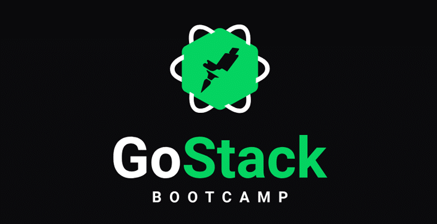

# BootCamp **14**

# Gobarber 

### :gear: Backend

 
#### :computer: Tecnologias

NODE | TypeScript | TypeORM | PostgreSQL | Docker | 

  
  
  
  
   
  
  

### Frontend Web

#### :computer: Tecnologias

React | TypeScript | Axios | ContextAPI

  
  
  
  
   
  
  

### Frontend Mobile

#### :computer: Tecnologias

ReactNative | TypeScript | Axios | ContextAPI 

  
  
  
  
   
  
  

